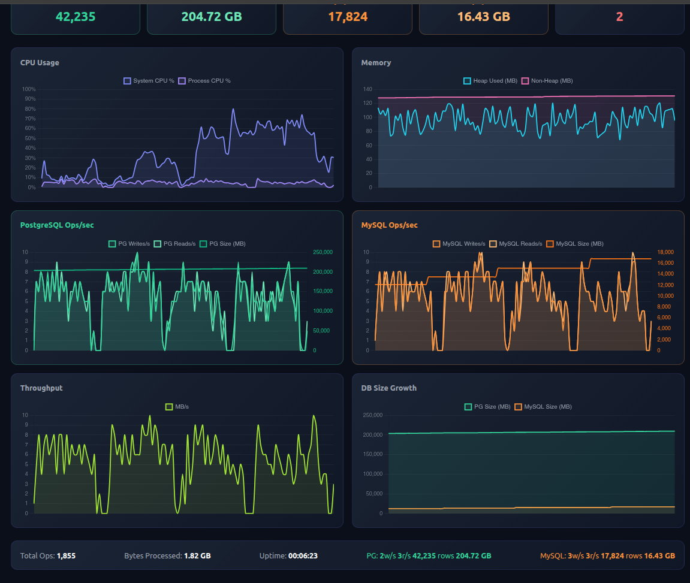

<div align="center">

# Grindstone

**Multi-threaded infrastructure stress testing engine**

[](https://openjdk.org/)
[](https://spring.io/projects/spring-boot)
[](https://hibernate.org/)
[](https://www.postgresql.org/)
[](https://heroku.com/)
[](LICENSE)

Grinds CPU, RAM, and multiple PostgreSQL databases simultaneously with configurable multi-threaded workers.\
Real-time dashboard. Persistent writes. No deletes. Databases grow until you pull the plug.

Currently drives **5 PostgreSQL databases**: 2 stopped (stats-only, retained data) + 3 active (Purple / Amber / Olive) handling live write/read load.

---



</div>

---

## How It Works

Each worker thread executes a relentless loop:

```
READ chunk from video file
    |
HASH with SHA-256 (N rounds)
    |
WRITE to Purple --+-- WRITE to Amber --+-- WRITE to Olive
    |                  |                    |
READ BACK + verify  READ BACK + verify   READ BACK + verify
    |
MATRIX MULTIPLY (CPU burn)
    |
ALLOCATE memory buffer (RAM pressure)
    |
REPEAT
```

All writes persist. The 3 active databases accumulate data independently. The 2 stopped databases (PG1, PG2) retain prior data and are polled for size/row stats only. Hash verification catches integrity failures in real time.

---

## Live Dashboard

The built-in dashboard at `/` streams metrics over WebSocket at 1-second intervals.

| Panel | Metrics |
|:---|:---|
| **System** | CPU (system + process), heap used / max, non-heap |
| **Databases** | Per-DB card grid (5 DBs): rows, storage bar, writes/s, reads/s, active/stopped badge |
| **DB Writes/Reads** | Per-active-DB writes/s and reads/s over time |
| **Throughput** | MB/s processed, total bytes |
| **DB Size Growth** | All 5 DB sizes over time |
| **Controls** | Start/Stop, thread count, chunk size |

---

## Tech Stack

| Layer | Technology |
|:---|:---|
| Runtime | `Java 21` / `OpenJDK` |
| Framework | `Spring Boot 4.0.6` / `Hibernate ORM 7` |
| Databases | `5 × PostgreSQL` via SchemaToGo (2 stopped, 3 active) |
| Connection Pool | `HikariCP` (per-DB pools) |
| Real-time | `WebSocket` (1s push interval) |
| Frontend | `TailwindCSS` / `Chart.js 4` |
| Deployment | `Heroku` (multi-dyno) |

---

## Configuration

<details>
<summary><b>Environment Variables</b></summary>

<br>

#### Load Test

| Variable | Default | Description |
|:---|:---:|:---|
| `LOADTEST_THREADS` | `20` | Worker threads per dyno |
| `LOADTEST_CHUNK_MB` | `10` | Chunk size read from video file |
| `LOADTEST_HASH_ROUNDS` | `5` | SHA-256 rounds per chunk |
| `LOADTEST_MATRIX_SIZE` | `200` | N x N matrix multiply |
| `LOADTEST_MEMORY_MB` | `500` | Rolling memory buffer pool (MB) |
| `LOADTEST_AUTO_START` | `false` | Begin grinding on boot |
| `LOADTEST_GENERATE` | `false` | Generate synthetic video if missing |
| `LOADTEST_GENERATE_SIZE_MB` | `100` | Generated file size |

#### Databases

`PG1` (primary) is always on. `PG2`–`PG5` activate via their `*_ENABLED` flag.
PG1 + PG2 = **stopped** (stats-only, retained data). PG3/PG4/PG5 (Purple/Amber/Olive) = **active** write/read load.

| DB | Label | Role | Vars |
|:---|:---|:---|:---|
| `PG`  | PG1    | stopped | `PG_URL` `PG_USERNAME` `PG_PASSWORD` `HIKARI_MAX_POOL` `PG_MAX_BYTES` |
| `PG2` | PG2    | stopped | `PG2_ENABLED` `PG2_URL` `PG2_USERNAME` `PG2_PASSWORD` `PG2_HIKARI_MAX_POOL` `PG2_MAX_BYTES` |
| `PG3` | Purple | active  | `PG3_ENABLED` `PG3_URL` `PG3_USERNAME` `PG3_PASSWORD` `PG3_HIKARI_MAX_POOL` `PG3_MAX_BYTES` |
| `PG4` | Amber  | active  | `PG4_ENABLED` `PG4_URL` `PG4_USERNAME` `PG4_PASSWORD` `PG4_HIKARI_MAX_POOL` `PG4_MAX_BYTES` |
| `PG5` | Olive  | active  | `PG5_ENABLED` `PG5_URL` `PG5_USERNAME` `PG5_PASSWORD` `PG5_HIKARI_MAX_POOL` `PG5_MAX_BYTES` |

Pool defaults: stopped DBs `2`, active DBs `20`. Storage capacity default `3TiB` each.
Total connections per DB = `dynos × pool_size` — keep under each DB's 10,000 max.

</details>

---

## Deployment

```bash
# Create app + 5 databases (2 stopped, 3 active)
heroku create grindstone-app
for i in 1 2 3 4 5; do heroku addons:create schematogo:premium-10; done

# Configure per-dyno resources (scale as needed)
heroku config:set \
  LOADTEST_THREADS=20 \
  LOADTEST_CHUNK_MB=1 \
  LOADTEST_MEMORY_MB=10 \
  LOADTEST_AUTO_START=true \
  LOADTEST_GENERATE=true \
  JAVA_OPTS="-Xmx300m -Xms200m" \
  DDL_AUTO=update \
  HIKARI_MAX_POOL=2 PG2_HIKARI_MAX_POOL=2 \
  PG2_ENABLED=true PG3_ENABLED=true PG4_ENABLED=true PG5_ENABLED=true

# Set credentials for each DB (from each SchemaToGo addon config)
heroku config:set PG_URL=...  PG_USERNAME=...  PG_PASSWORD=...
heroku config:set PG2_URL=... PG2_USERNAME=... PG2_PASSWORD=...   # stopped
heroku config:set PG3_URL=... PG3_USERNAME=... PG3_PASSWORD=...   # Purple
heroku config:set PG4_URL=... PG4_USERNAME=... PG4_PASSWORD=...   # Amber
heroku config:set PG5_URL=... PG5_USERNAME=... PG5_PASSWORD=...   # Olive

# Deploy and scale
git push heroku main
heroku ps:scale web=50
```

> **Note:** When running multiple dynos, keep per-dyno pool sizes low.\
> Total connections = `dynos * pool_size` must stay under the database's max connections.

---

## Project Structure

```
src/main/java/com/test/load/
|
+-- config/
|   +-- PostgresDataSourceConfig    PG1 primary datasource (stopped, stats-only)
|   +-- Pg2DataSourceConfig         PG2 datasource (stopped, conditional)
|   +-- Pg3/Pg4/Pg5DataSourceConfig Active datasources (Purple/Amber/Olive)
|   +-- WebSocketConfig             /ws/stats endpoint
|   +-- FileInitializer             Synthetic video generator
|
+-- entity/
|   +-- pg/PgVideoChunk             PG1 entity (bytea)
|   +-- pg2..pg5/PgNVideoChunk      Per-DB entities (bytea)
|
+-- repository/
|   +-- pg/PgVideoChunkRepository
|   +-- pg2..pg5/PgNVideoChunkRepository
|
+-- service/
|   +-- LoadTestService             Worker pool, multi-DB write loop
|   +-- StatsService                Per-DB counters, snapshots
|
+-- controller/
|   +-- LoadTestController          REST endpoints
|
+-- websocket/
    +-- StatsWebSocketHandler       Broadcast to connected clients

src/main/resources/
+-- static/index.html               Dashboard (Tailwind + Chart.js)
+-- application.properties          Config with env var fallbacks
```

---

## API Reference

```
POST /api/start        Start the grind
                       Body: {"threads": 4, "chunkSizeMb": 1}

POST /api/stop         Stop all workers

GET  /api/status       Current metrics snapshot (JSON)

GET  /api/config       Running configuration

WS   /ws/stats         Real-time metrics stream (1s interval)
```

<details>
<summary><b>Example /api/status response</b></summary>

```json
{
  "cpuUsage": 34.2,
  "processCpuUsage": 10.0,
  "heapUsed": 86781776,
  "heapMax": 314572800,
  "opsPerSecond": 8.3,
  "databases": [
    { "key": "pg",  "label": "PG1",    "active": false, "enabled": true,
      "insertsPerSecond": 0, "readsPerSecond": 0, "rowCount": 45570, "sizeBytes": 223479092915, "maxBytes": 3298534883328 },
    { "key": "pg2", "label": "PG2",    "active": false, "enabled": true,
      "insertsPerSecond": 0, "readsPerSecond": 0, "rowCount": 21217, "sizeBytes": 21454405632, "maxBytes": 3298534883328 },
    { "key": "pg3", "label": "Purple", "active": true,  "enabled": true,
      "insertsPerSecond": 4.2, "readsPerSecond": 4.2, "rowCount": 1203, "sizeBytes": 9437184, "maxBytes": 3298534883328 },
    { "key": "pg4", "label": "Amber",  "active": true,  "enabled": true,
      "insertsPerSecond": 4.1, "readsPerSecond": 4.1, "rowCount": 1199, "sizeBytes": 9412608, "maxBytes": 3298534883328 },
    { "key": "pg5", "label": "Olive",  "active": true,  "enabled": true,
      "insertsPerSecond": 4.0, "readsPerSecond": 4.0, "rowCount": 1188, "sizeBytes": 9388032, "maxBytes": 3298534883328 }
  ],
  "totalOps": 18211,
  "activeThreads": 20,
  "errors": 0,
  "running": true
}
```

</details>

---

<div align="center">
<sub>Built to break things responsibly.</sub>
</div>
